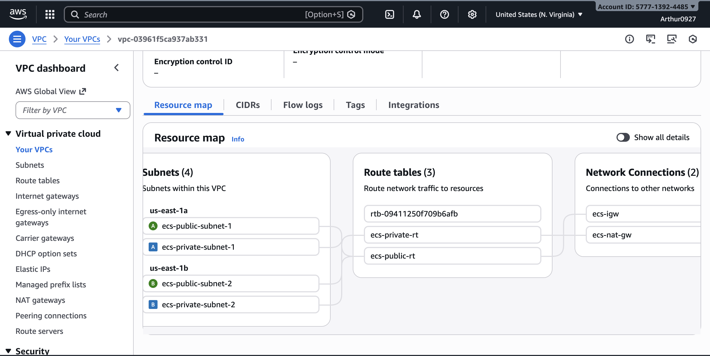
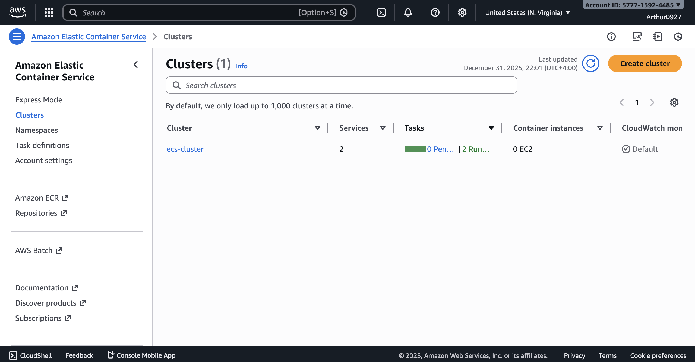
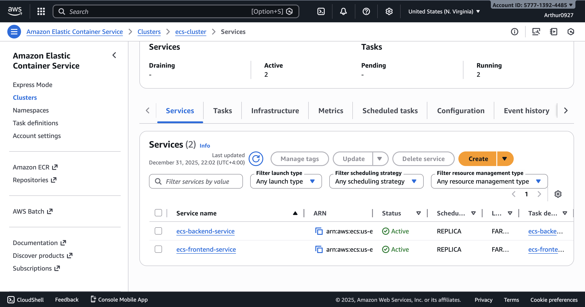
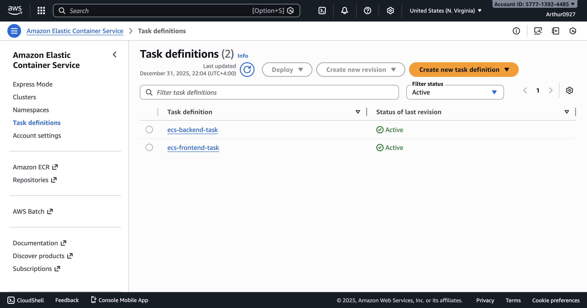
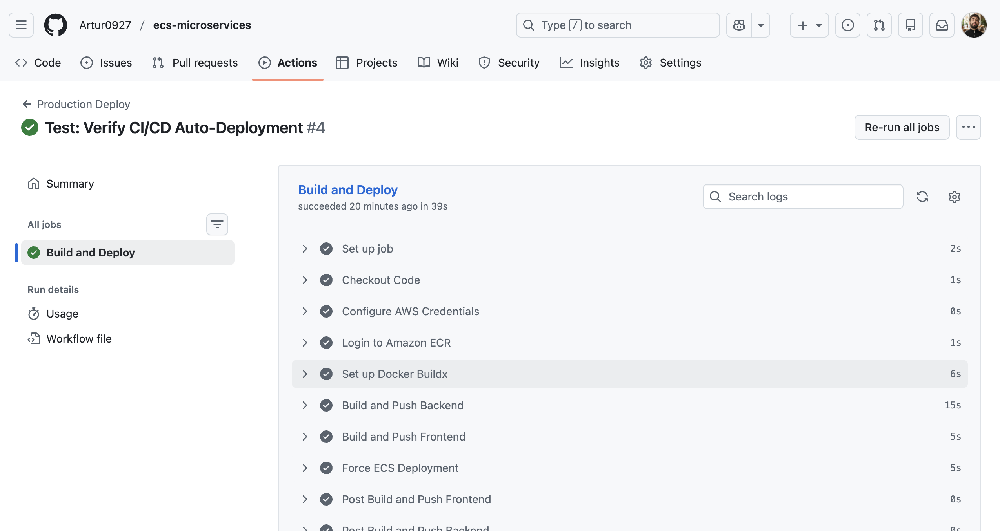

# AWS ECS Microservices Infrastructure with IaC & CI/CD


## Architecture Overview

This project implements a production-grade, highly available microservices architecture on AWS. It leverages **ECS Fargate** for serverless container orchestration, effectively eliminating infrastructure management overhead while ensuring scalability.

### Network Topology
The network topology allows for strict security isolation:
-   **Public Subnets**: Host the Application Load Balancer (ALB) and NAT Gateways.
-   **Private Subnets**: Host the application workloads (Frontend and Backend containers), ensuring no direct internet access to compute resources.
-   **Security Groups**: Implement strict least-privilege networking.



## Key Features

-   **Infrastructure as Code (IaC):** Complete infrastructure provisioning using modular **Terraform**, ensuring reproducibility and drift detection.
-   **Zero-Downtime Deployment:** Rolling updates managed natively by ECS, ensuring high availability during release cycles.
-   **Security First:** Architecture adheres to AWS Well-Architected Framework principles, utilizing private subnets, refined IAM roles, and encrypted ECR repositories.

## Container Orchestration

Deployed on **AWS ECS Fargate**, providing a secure, serverless runtime for containerized applications.

### ECS Cluster


### Microservices Status


### Task Definitions & Configuration


## CI/CD Automation

A robust **GitHub Actions** pipeline implements enterprise patterns:
-   **Pull Request Workflow**: CI pipeline triggers on pull requests for validation (builds images without pushing).
-   **Merge-Based Deployment**: Deployment automatically triggers when pull requests are merged to `main`, ensuring code review before production.
-   **Docker Layer Caching**: Optimized build times using `gha` cache backend.
-   **Immutable Tagging**: Images tagged with both `latest` and `git-sha` for auditability and rapid rollbacks.
-   **Automated Deployment**: Direct integration with ECS for immediate updates on merge.
-   **Manual Terraform**: Infrastructure changes are managed through manual workflow dispatch for controlled deployments.



## Tech Stack

-   **Infrastructure:** Terraform, AWS (VPC, ECS, Fargate, ALB, CloudWatch, ECR)
-   **Backend:** Python (FastAPI)
-   **Frontend:** React / Nginx
-   **CI/CD:** GitHub Actions, Docker, Make

## Project Structure

```bash
.
├── .github/workflows   # CI/CD Pipelines (Build, Push, Deploy)
├── backend/            # Python FastAPI Service & Dockerfile
├── frontend/           # Nginx/React Service & Dockerfile
├── terraform/          # Infrastructure as Code
│   ├── main.tf         # Entry point
│   ├── vpc.tf          # Network Topology
│   ├── ecs.tf          # Cluster & Service Definitions
│   ├── alb.tf          # Load Balancer Configuration
│   ├── variables.tf    # Configurable inputs
│   └── ...
└── ...
```

## Getting Started

### Prerequisites

-   AWS CLI configured with appropriate permissions.
-   Terraform v1.0+.
-   Docker installed locally.

### Deployment

1.  **Initialize Infrastructure:**
    Navigate to the terraform directory and initialize the state.
    ```bash
    cd terraform
    terraform init
    ```

2.  **Review Plan:**
    Verify the resources to be created.
    ```bash
    terraform plan
    ```

3.  **Apply Configuration:**
    Provision the AWS infrastructure.
    ```bash
    terraform apply -auto-approve
    ```

4.  **Continuous Deployment:**
    The CI/CD pipeline automatically triggers on pull requests:
    - **On Pull Request**: Builds Docker images locally for validation (no deployment)
    - **On Merge to Main**: Builds, pushes images to ECR, and deploys to ECS automatically
    
    Workflow:
    ```bash
    # Create a feature branch and make changes
    git checkout -b feature/my-feature
    git add .
    git commit -m "Add new feature"
    git push origin feature/my-feature
    
    # Create a pull request on GitHub
    # CI will run and validate the build
    
    # After merging the PR to main, deployment happens automatically
    ```

5.  **Infrastructure Management:**
    Terraform changes are managed manually through GitHub Actions workflow dispatch:
    - Navigate to Actions → "Manual Terraform" workflow
    - Select environment and action (plan/apply)
    - Confirm with "APPLY" for apply operations
